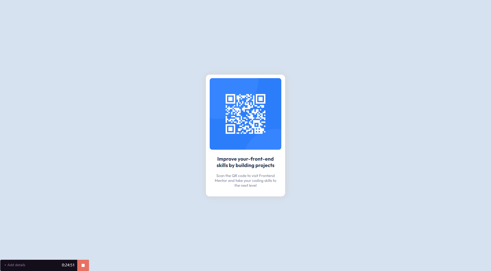

# Frontend Mentor - QR code component solution

This is a solution to the [QR code component challenge on Frontend Mentor](https://www.frontendmentor.io/challenges/qr-code-component-iux_sIO_H). Frontend Mentor challenges help you improve your coding skills by building realistic projects. 

## Table of contents

  - [Screenshot](#screenshot)
  - [Links](#links)
  - [My process](#my-process)
  - [Built with](#built-with)
  - [What I learned](#what-i-learned)
  - [Continued development](#continued-development)
  - [Useful resources](#useful-resources)
  - [Author](#author)

### Screenshot

Add a screenshot of your solution. The easiest way to do this is to use Firefox to view your project, right-click the page and select "Take a Screenshot". You can choose either a full-height screenshot or a cropped one based on how long the page is. If it's very long, it might be best to crop it.

Alternatively, you can use a tool like [FireShot](https://getfireshot.com/) to take the screenshot. FireShot has a free option, so you don't need to purchase it. 

Then crop/optimize/edit your image however you like, add it to your project, and update the file path in the image above.

### Links

- Solution URL: [Add solution URL here](https://your-solution-url.com)
- Live Site URL: [Add live site URL here](https://your-live-site-url.com)

## My process
Creating div containers for background and easy access to editing css later, really helped me during this tutorial.
### Built with

- Semantic HTML5 markup
- CSS custom properties
- Flexbox

### What I learned

I learned the basics of how making a real project is. I also learned how to do box shadows, and realised that developing without proper figma file is really hard. Trying to guess all of the margins and sizes of things is really hard.

### Continued development

I need to focus on using flexbox and grid layout, as well as box sizing, margins padding and borders. I still don't feel completely comfortable with figuring out the layout of things.

### Useful resources

- [box-shadow](https://www.w3schools.com/csS/css3_shadows.asp) this article helped me to understand box shadows

## Author

- Frontend Mentor - [@TheGroobi](https://www.frontendmentor.io/profile/TheGroobi)
